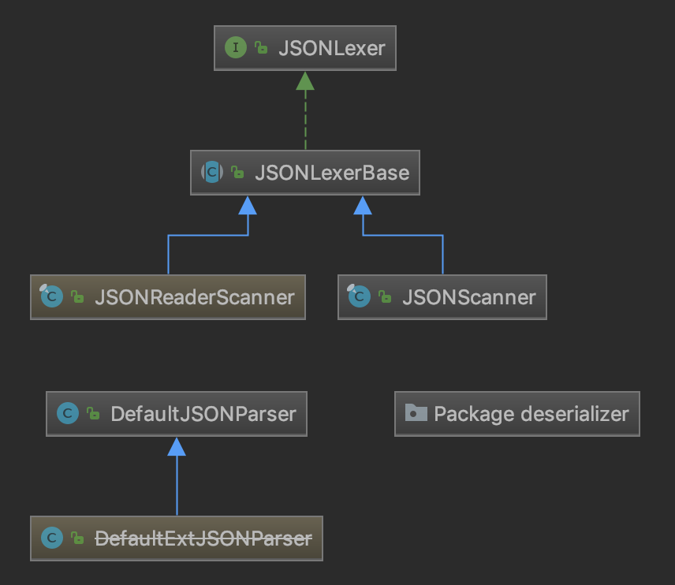
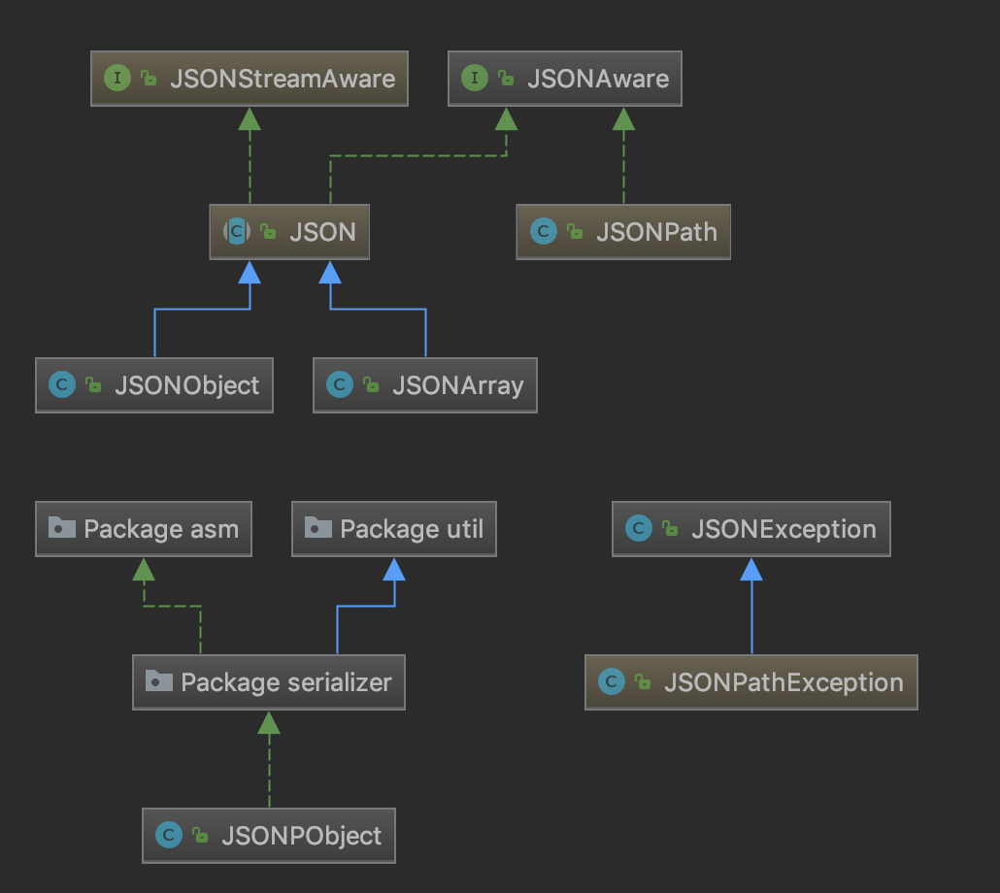
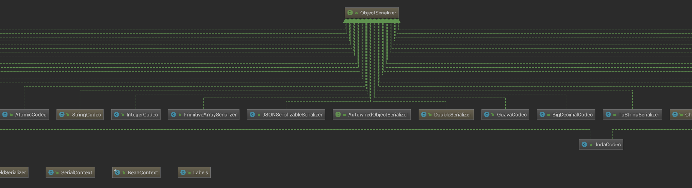
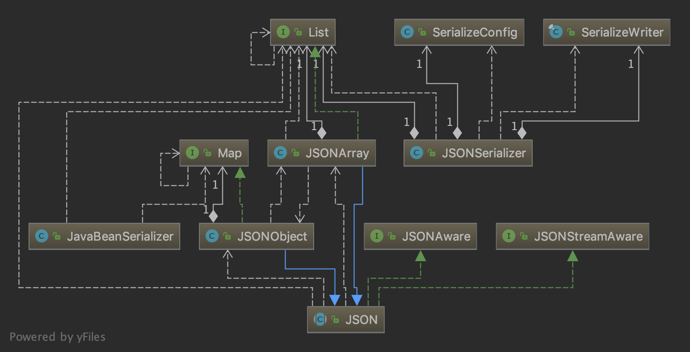

# fastjson 学习报告


## 声明

欢迎任课老师和助教以及其他来自互联网的读者阅读此报告。我于 2018 年秋季加入国科大“面向对象程序设计”课程，并选择 fastjson 作为源码学习环节的目标项目。此文即为我的源码学习报告。由于这是面向对象课程的作业，所以和算法相关的内容不是解析的重点。

由于时间关系，我会从 2018 年 10 月 31 日起陆续上传并更新此报告，每一次更新除了会增加新的章节，还会修改过去的内容。鉴于整个报告只分为三个周期完成，所以每一次更新时我对 fastjson 的理解必定会有很大的不同，修改的内容也会非常多，一般不会注明哪些内容已经被修改或更正，批改作业的老师只需将每一次报告单独作为阶段作业提交的内容批改即可。望老师们谅解。

本文分析的目标是阿里巴巴的 fastjson 开源项目，源码地址为：[github.com/alibaba/fastjson](http://github.com/alibaba/fastjson).版本为1.2.49（但不一定一直坚持使用该版本，针对具体情况会具体说明）。文中会用到一些示例测试程序和 UML 图分析，我使用的工具是 JetBrains 公司的 IntelliJ IDEA.

欢迎各位老师、同学和来自互联网的读者参与课程讨论。如果你在文中发现了任何你确认是错误的内容，请与作者联系，我将对此不胜感激！

雷正宇 2018年10月31日

邮箱：leizhengyu16@mails.ucas.ac.cn

---

时隔两年，在我完成这门课的学习后，我再次荣幸地受到王伟老师的邀请分享自己的学习报告。在感慨自己的学习成果受到老师认同的同时，我意识到我要承担一份似乎突如其来的责任——对原先的报告进行修改和完善。之所以说是责任，原因有二：一是对于我这样一个计算机专业的学生来说，“面向对象程序设计”课程的学习远远没有完结，这门课程的理想目标远非是在课堂上、一个学期的时间能完成的；二是既然已经或多或少掌握了些似懂非懂的知识，将它尽可能传授下去永远是学习者的义务。

要传下去，就必然要避免出错。我想说的是，两年前写下的东西两年后再来看，哪怕自己的境界没有质的提升，还是感到十分羞耻。文中有不少由不成熟的知识体系造成的纰漏和对项目的误解；有为了暂时性地完成功课而补充的一些和项目无关的学习感悟；甚至，没有写完。

现在要改，主要就是针对以上这三点。但我要在此声明，此次修改后以上三点中的任意一点都将会延续下来。也就是说，你们将看到的内容仍然会有纰漏——这是因为人都会犯错，两年前能够犯错，今日也必定还会；会有和项目无关的学习感悟——我很珍视这一部分内容，因为这份报告毕竟是给你们——我的国科大学弟学妹们看的，对你们而言，读一些学习感悟或许会有更多的收获；仍然不能完结——是的，我不打算完结，事实上也不可能完结（原因实在太多了，在此不解释）。

另外，在专业知识层面，我要声明：两年来我并未参与大型软件的开发，参与的项目也极少使用到面向对象的方法体系，所以和软件开发相关的知识中我可能会犯更多的错误；同时，我在程序设计语言理论以及程序编译技术方面的知识进步使得我在这两方面的见解是更值得关注的。

本文的章节组织几乎是没什么逻辑和规律的，这是作为作业的一大遗憾。大家在阅读时，需根据目录内容来选择。如果选择按顺序读，那几乎就是我当时写作时的思维顺序。

如果你在文中发现了任何你确认是错误的内容，请与作者联系，我将对此不胜感激！

雷正宇 2020年9月18日

邮箱：leizhengyu16@mails.ucas.ac.cn 或 leizhengyu20s@ict.ac.cn 

# 第一章：导言

导言部分将会从一些简单的示例入手，从浅层面、多方面、以面向对象的视角展示以及分析部分源码。

## 1.1 什么是 JSON

曾经有一段时间，XML 是互联网上传输结构化数据的标准。Web 服务的第一次浪潮很大程度上都是建立在 XML 上的，突出的特点是服务器与服务器之间的通信。然而，业界一直不乏质疑 XML 的声音。不少人认为 XML 过于繁琐、冗长。为解决这个问题，也涌现了一些方案。不过，Web 的发展方向已经改变了。

2006 年，Douglas Crockford 把 JSON（JavaScript Object Notation，即 JavaScript 对象表示法）作为 IETF RFC 4627 提交给 IETF，而 JSON 的应用早在 2001 年就已经开始了。JSON 是 JavaScript 的一个严格的子集，利用了 JavaScript 中的一些模式来表示结构化数据。Crockford 认为与 XML 相比，JSON 是在 JavaScript 中读写结构化数据的更好的方式。因为可以把 JSON 直接传给 eval(), 而且不必创建 DOM 对象。

关于 JSON，最重要的是要理解它是一种数据格式，而不是一种编程语言。虽然具有相同的语法形式，但 JSON 并不属于 JavaScript。而且，并不是只有 JavaScript 才使用 JSON，毕竟 JSON 只是一种数据格式。很多编程语言都有针对 JSON 的解析器和序列化器。

> （美）Nicholas C. Zakas. Professional JavaScript for Web Developers 3rd Edition \[M\].北京：人民邮电出版社，2012.3（2017.10重印）: 562

## 1.2 什么是 fastjson

fastjson 是阿里巴巴的开源 JSON 解析库，它可以解析 JSON 格式的字符串，支持将Java Bean 序列化为 JSON 字符串，也可以从 JSON 字符串反序列化到 JavaBean。fastjson 是个非常优秀的 JSON 解析库，被不少企业使用，其优点主要在于：

### 速度快

fastjson 相对其他 JSON 库的特点是快，从 2011 年 fastjson 发布 1.1.x 版本之后，其性能从未被其他 Java 实现的 JSON 库超越。

### 使用广泛

fastjson 在阿里巴巴大规模使用，在数万台服务器上部署，fastjson 在业界被广泛接受。在 2012 年被开源中国评选为最受欢迎的国产开源软件之一。

### 测试完备

fastjson 有非常多的 testcase，在 1.2.11 版本中，testcase 超过 3321 个。每次发布都会进行回归测试，保证质量稳定。

### 使用简单

fastjson 的 API 十分简洁：

```java
String text = JSON.toJSONString(obj); //序列化
VO vo = JSON.parseObject("{...}", VO.class); //反序列化
```

### 功能完备

支持泛型，支持流处理超大文本，支持枚举，支持序列化和反序列化扩展。

以上一段都是来自 alibaba 的官方文档：

> [https://github.com/alibaba/fastjson/wiki/Quick-Start-CN](https://github.com/alibaba/fastjson/wiki/Quick-Start-CN)

官方文档当然会尽量提项目的优点。在后面的解析中，我们会对这些“优点”进行客观分析。

## 1.3 从简单示例漫游 fastjson

一个针对 Java 的 JSON 解析框架最基本的功能是解析和序列化，下面示例定义了一个简单的符合 JSON Object 语法的 Java 字符串：

```java
String jobjstr = "{" +
    "\"name\": \"John\"," +
    "\"age\": 18" +
    "}";
```

由于 JSON 本身有很好的可读性，所以这里不再对字符串的内容加以解释。现在我们使用 fastjson 框架，用 parse 方法将上述字符串解析为 Java 对象：

```java
JSONObject jobj = JSONObject.parseObject(jobjstr);
System.out.println("name: " + jobj.getString("name") +
    ", age: " + jobj.getInteger("age"));
```

这段测试程序输出的结果是：

```java
name: John, age: 18
```

现在将之前得到的 JSONObject 对象转化为字符串：

```java
String str = jobj.toJSONString();
System.out.println(str);
```

输出结果为：

```java
{"name":"John","age":18}
```

现在我们关注解析字符串的关键语句：

```java
JSONObject jobj = JSONObject.parseObject(jobjstr);
```

让我们追根溯源，看看 `parseObject` 方法到底是怎么工作的。首先，`parseObject(String)` 方法并不是 JSONObject 类中定义的静态方法，而是 `JSONObject` 继承自 JSON 类的一个静态方法，且没有重写，所以这条语句写成 `JSONObject jobj = JSON.parseObject(jobjstr)` 也是完全没有问题的（事实上，JSON 类就是 fastjson 使用的入口）。以下代码中，除了少数注释为我自己添加，其余部分均来自[github.com/alibaba/fastjson](http://github.com/alibaba/fastjson)，这些代码和编译工具通过 .class 文件反编译出的代码大同小异（不得不说，IntelliJ IDEA 的 Fernflower 反编译器产生的代码有很好的可读性）。以下是该方法的定义：

```java
    public static JSONObject parseObject(String text) {
        Object obj = parse(text);
        if (obj instanceof JSONObject) {
            return (JSONObject) obj;
        }
    
        try {
            return (JSONObject) JSON.toJSON(obj);
        } catch (RuntimeException e) {
            throw new JSONException("can not cast to JSONObject.", e);
        }
    }
// 该方法中调用了重载的 parseObject 方法，定义如下

    public static JSONObject parseObject(String text, Feature... features) {
        return (JSONObject) parse(text, features);
    }
// 该方法又调用了 parse 方法，定义如下
    public static Object parse(String text, Feature... features) {
        int featureValues = DEFAULT_PARSER_FEATURE;
        for (Feature feature : features) {
            featureValues = Feature.config(featureValues, feature, true);
        }

        return parse(text, featureValues);
    }

    public static Object parse(String text, int features) {
        return parse(text, ParserConfig.getGlobalInstance(), features);
    }
// 继续追溯

    public static Object parse(String text, ParserConfig config, int features) {
        if (text == null) {
            return null;
        }

        DefaultJSONParser parser = new DefaultJSONParser(text, config, features);
        Object value = parser.parse();

        parser.handleResovleTask(value);

        parser.close();

        return value;
    }
```

最终我们发现，真正的解析工作是一个实例化的解析器 parser 完成的，关键的方法是 parse() 方法，现在我们可以进入 DefaultJSONParser 的内部探索：

```java
    public Object parse() {
        return parse(null);
    }
    // Java 不支持默认参数，用方法重载来达到简化调用的效果

    // 下面的方法接近100行，省略了大部分case
    public Object parse(Object fieldName) {
        final JSONLexer lexer = this.lexer;
        switch (lexer.token()) {
            ...
            case LBRACE:
                JSONObject object = new JSONObject(lexer.isEnabled(Feature.OrderedField));
                return parseObject(object, fieldName);
            ...
            default:
                throw new JSONException("syntax error, " + lexer.info());
        }
    }
```

为了完整性，我粘贴出了整个方法实现。词法分析是整个解析算法的基础，很重要，但不是我们研究的重点，所以这里不进行详细解释。在我们的例子中我定义的字符串 jobjstr 开头为左花括号'{'，因此在 switch-case 语句中，我们直接定位到第10行：

```java
case LBRACE:
    JSONObject object = new JSONObject(lexer.isEnabled(Feature.OrderedField));
    return parseObject(object, fieldName);
```

也就是说，当解析器检查发现第一个字符为左花括号时，便调用 `parseObject` 方法来解析花括号内部的内容。我们知道花括号内部必定是个 `JSON` Object，当然，它也有可能是个复杂 `Object`，所以我们可以猜测，parseObject 方法内必定有对 parseArray 和 parseObject 方法的递归调用。要注意，此时的 `parseObject` 方法和最初我们在 JSON.java 中发现的静态方法 `parseObject` 是完全不同的，前者是算法层面的调用，而非提供给用户的调用。

这里将不再展示 `parseObject` 方法内部的逻辑，一是由于这个方法的定义本身就很庞大，不适合一次性粘贴；二是因为第一章的目标已经达到了，我们完成了一次近乎完整的 fastjson 漫游，没必要注意太多细节，parse 方法作为整个解析算法的核心，必定会再度被讨论，但不是现在。

## 1.4 面向接口编程

我们已经通过一个简单的程序示例跟踪了 fastjson 的解析功能，下面我们将从不一样的角度来分析序列化功能。在研读源码前，我们可以先看一看 UML 类图，回顾一下漫游旅程。以下是1.3中出现过的包的类图：





为了节省篇幅，我省略了所有的字段、构造方法、一般方法和内部类。我们追踪的 `DefaultJSONParser` 就在这个 package parser 中，而 `JSONObject` 类以及其父类 `JSON` 在 package fastjson 中。

无论是通过源码文件中的类定义代码还是 UML 类图，都能很容易发现 JSON 类实现了结构 `JSONStreamAware` 和 `JSONAware`。这两个接口的定义很简单，源码如下：

```java
public interface JSONStreamAware {

    /**
     * write JSON string to out.
     */
    void writeJSONString(Appendable out) throws IOException;
}
```
```java
public interface JSONAware {

    /**
     * @return JSON text
     */
    String toJSONString();
}
```
`JSONStreamAware` 在所有支持 JSON 文本自定义输出到一个 `Writer` 的 Bean 中都应该被实现，而 `JSONAware` 在支持 JSON 文本自定义输出为字符串的 Bean 中都应该被实现。在 Java 程序设计语言中，接口 interface 提供了比抽象类“更加抽象”的抽象。如 Bruce Eckel 在《Java编程思想》中所言：“一个接口表示：‘所有实现了该特定接口的类看起来都像这样’。“以及”接口被用来建立类与类之间的协议“。

这里保留一个问题：在图 package fastjson 中，`JSONStreamAware` 接口看起来仅被 `JSON` 类实现了。以抽象的原则而言，接口的出现是为了更好地实现解耦和多态，仅有一个类实现接口是体现不出多态的。

回到上面提到的 `JSONAware` 接口，为了更好地说明它的作用，我们结合另一个接口的例子。下面是 serializer 的 UML 类图的一部分：



从这张模糊的截图也许不能获得很有用的信息，我只是想借此展现这个包中的大多数类都实现了 `ObjectSerializer` 这个接口，这个接口的定义如下：

```java
public interface ObjectSerializer {
    void write(JSONSerializer serializer, //
               Object object, //
               Object fieldName, //
               Type fieldType, //
               int features) throws IOException;
}
```
同样只有一个抽象方法！按照 Bruce Eckel 的说法，序列化器都应该像这样——拥有一个 `write` 方法，在不同的场景下完成相同的输出功能。这就意味着，对于上层调用，不需要考虑每一个序列化器具体是如何工作的，只需要针对不用的场景使用正确的序列化器即可。

现在我们终于可以回到 `JSONAware` 了，在 `JSONAwareSerializer` 中，`JSONAware` 作为接口体现了它解耦的功能：

```java
public class JSONAwareSerializer implements ObjectSerializer {

    public static JSONAwareSerializer instance = new JSONAwareSerializer();

    public void write(JSONSerializer serializer, Object object, Object fieldName, Type fieldType, int features) throws IOException {
        SerializeWriter out = serializer.out;

        if (object == null) {
            out.writeNull();
            return;
        }

        JSONAware aware = (JSONAware) object;
        out.write(aware.toJSONString());
    }
}
```
现在整个序列化器的结构就清晰很多了：接口 `ObjectSerializer` 规定序列化器必须有 write 方法，这是序列化器和上层调用之间的协议，`JSONAwareSerializer` 作为一个序列化器实现了自己的 `write` 方法。`JSONAware` 接口规定 toJSONString 方法必须被实现，这是 `JSONAware` 和序列化器之间的协议，`JSONAwareSerializer` 在实现中用到了 `JSONAware` 接口的 `toJSONString` 方法。同层次的类有相似之处，不同层次的类之间相互调用却有条不紊，通过利用接口达到了解耦的效果。

## 1.5 结语

在以上所有类图和源码中，不难发现一个事实：接口的功能重要而单一！这符合设计原则的单一职责原则。面向对象设计原则被总结为5～8个，有趣的是，这些原则本身就是“紧耦合”的。

一般来说，好的设计是能同时满足所有原则的，例如，在 fastjson 中，凡是使用了继承语法的地方，子类和父类之间必定有很强的“血缘”关系（事实上用到的继承语法很少），否则就会使用组合语法而不是继承。这符合开放封闭原则、里氏替换原则和合成/聚合原则。又例如上述的接口功能单一，符合依赖倒置原则、接口隔离原则，而接口的运用本身就满足了迪米特原则……

相反，如果发现某个设计破坏了其中的一个原则，那么它往往也破坏了几个其它的原则。归根结底，这些设计原则强调的都是同样的宗旨：抽象和封装。

fastjson 作为非常优秀的框架，自然还有很多值得挖掘的地方。在接下来的几章，我将会详细介绍其中序列化器、反序列化器的设计，词法、语法解析的实现方式，设计模式的分析等等。

另一方面，由于我先前没有系统学过 Java，只能在学习 fastjson 源码的过程中慢慢学习。目前写得少见得也少，不知道好的代码有多好，差的代码又怎么糟糕。在学习 fastjson 期间，我还会阅读一些其它项目的源码，在对比中分析、学习。

# 第二章：Serializer的结构

在导言部分，我们窥视了序列化器 package 的宏观结构，现在我们要跟着测试用例的执行轨迹深入到每一个类。

## 2.1 Serializer示例

fastjson 提供的 API 包含了各种类之间的转换方法，这一章要讨论的是序列化方法。序列化方法的 API 是 `JSON#toJSONString`。这个方法被重载多次，可以用于将多种不同的类型转化为字符串。在第一章的示例中，我们演示了 `toJSONString` 将一个 `JSONObject` 对象转化为字符串的操作，现在我们看几个更复杂的例子：

```java
Person tomy = new Person(12, "Tomy");
Person bob = new Person(10, "Bob");
List<Person> students = new ArrayList<Person>(Arrays.asList(tomy, bob));

System.out.println(JSON.toJSONString(tomy));
System.out.println(JSON.toJSONString(students));
System.out.println(JSON.toJSONString(tomy, SerializerFeature.BeanToArray));
```

这个测试用例的输出是：

```json
{"age":12,"name":"Tomy"}
[{"age":12,"name":"Tomy"},{"age":10,"name":"Bob"}]
[12,"Tomy"]
```

其中 Person 类是我自己设计的一个简单的 JavaBean（没有重写 `toString` 方法），只包含 `age` 和 `name` 两个属性。可以看出，`toJSONString` 方法能准确地将 JavaBean 转化为字符串，而且能够把 JavaBean 的 List 转化为 json 数组形式的字符串。而且在第三个打印示例中，我将一个 JavaBean 转化成了 json 数组形式的字符串，这在你不需要 key 的信息或者相比于 key 的信息你更关心缩减字符串长度和序列化速度时会很有用。

当然，你也可以把这些 JavaBean 对象转化成 JSONObject 或者 JSONArray，用 `toJSON` 方法就可以了。同样的，JavaBean 可以被转化成去掉 key 的 JSONArray。BeanToArray 是一种映射模式，与之对应的是反序列化的 ArrayToBean 模式。BeanToArray 模式和普通模式相比拥有更好的性能。

## 2.2 SerializeWriter类

`JSON#toJSONString` 方法在 JSON.java 中被重载了 10 次，其中大部分是为了简化方法调用，核心方法只有以下两个：

```java
public abstract class JSON implements JSONStreamAware, JSONAware {
    public static String toJSONString(Object object, int defaultFeatures, SerializerFeature... features) {
        SerializeWriter out = new SerializeWriter((Writer) null, defaultFeatures, features);

        try {
            JSONSerializer serializer = new JSONSerializer(out);
            serializer.write(object);
            return out.toString();
        } finally {
            out.close();
        }
    }
    
    public static String toJSONString(Object object, // 
                                      SerializeConfig config, // 
                                      SerializeFilter[] filters, // 
                                      String dateFormat, //
                                      int defaultFeatures, // 
                                      SerializerFeature... features) {
        SerializeWriter out = new SerializeWriter(null, defaultFeatures, features);

        try {
            JSONSerializer serializer = new JSONSerializer(out, config);
            
            if (dateFormat != null && dateFormat.length() != 0) {
                serializer.setDateFormat(dateFormat);
                serializer.config(SerializerFeature.WriteDateUseDateFormat, true);
            }

            if (filters != null) {
                for (SerializeFilter filter : filters) {
                    serializer.addFilter(filter);
                }
            }

            serializer.write(object);

            return out.toString();
        } finally {
            out.close();
        }
    }
}
```
忽略一些暂时还不用关心的细节，这两个方法本质是一样的。我们关注以下三句：

```java
SerializeWriter out = new SerializeWriter((Writer) null, defaultFeatures, features);
JSONSerializer serializer = new JSONSerializer(out);
serializer.write(object);
```

首先创造一个 `SerializeWriter` 对象 `out`，`SerializeWriter` 类继承自 `java.io.Writer` 类，内部通过组合一个 `Writer` 对象来实现。这使得 JSON 对` OutputStream` 和 `Writer` 的支持成为可能，尽管这并不是 `SerializeWriter` 设计的主要目的。关注 `SerializeWriter` 类的一个字段 `buf`：

```java
public final class SerializeWriter extends Writer {
    protected char                           buf[];
    protected int                            count;
    private final Writer                     writer;
    /* 
    ***
    */
}
```
这个字符数组 `buf` 会在构造其中被分配长度，默认是 2048 (v1.2.54). 这使得 `SerializeWriter` 看起来和 `StringBuilder` 很相似。`StringBuilder` 的使用可以在拼接字符串时避免产生很多不必要的中间对象，而且主动指定字符缓冲区长度能够避免多次重新分配缓冲。同样，序列化 Java 对象时也需要考虑这个问题，`SerializeWriter` 的使用不仅是一种优化，在面向对象编程中也是必要的。

SerializeWriter.java 中就能找到写入缓冲区的方法实现：

```java
public final class SerializeWriter extends Writer { 
     /**
     * Writes a character to the buffer.
     */
    public void write(int c) {
        int newcount = count + 1;
        if (newcount > buf.length) {
            if (writer == null) {
                expandCapacity(newcount);
            } else {
                flush();
                newcount = 1;
            }
        }
        buf[count] = (char) c;
        count = newcount;
    }
}
```
`write` 方法也有直接写入多个字符的实现（事实上它继承自 `Writer`，是必须实现的），逻辑稍显复杂，我选择呈现写入单个字符的 `write`。通过这个实现能进一步确定 `SerializeWriter` 作为缓冲区的作用。

## 2.3 JSONSerializer类

但 `SerializeWriter#write` 方法此时还不能被调用，在真正生成字符串之前，我们还需要很多信息：我们至少要知道我们要向 `buf` 里写什么！回到我之前浓缩的三条语句，第二条用已经生成的 `SerializeWriter` 对象 `out` 创建了一个 `JSONSerializer` 对象 `serializer`。这个类名让人有些摸不着头脑。`serializer` 对象中维护着一个 SerializeConfig 对象 config 和一个 `SerializeWriter` 对象 `out`，如下：

```java
public class JSONSerializer extends SerializeFilterable {
    protected final SerializeConfig                  config;
    public final SerializeWriter                     out;
}
```
在我们的例子中，构造方法只传入了 `SerializeWriter`，此时配置参数 config 由配置参数的全局实例替代（全局实例是一个不含任何额外信息的朴素常量）。当 `serializer.write` 被调用时，又一个名为 `writer` 的对象被创建用来执行一个名字仍然是 `write` 的方法：

```java
public class JSONSerializer extends SerializeFilterable {
    public final void write(Object object) {
        if (object == null) {
            out.writeNull();
            return;
        }

        Class<?> clazz = object.getClass();
        ObjectSerializer writer = getObjectWriter(clazz);

        try {
            writer.write(this, object, null, null, 0);
        } catch (IOException e) {
            throw new JSONException(e.getMessage(), e);
        }
    }
}
```
这个 `writer` 本质上是一个 `IdentityHashMap`，先不讨论它的创建过程，我们通过参数传递知道这个 `writer` 包含了 `object` 的类型信息就可以了。回忆一下，在我们的测试用例中，上面这个函数的参数是一个 JavaBean。`ObjectSerializer` 接口中声明了 `write` 方法：

```java
public interface ObjectSerializer {
    void write(JSONSerializer serializer, //
               Object object, //
               Object fieldName, //
               Type fieldType, //
               int features) throws IOException;
}
```
最终 `write` 是如何执行的取决于从 `getObjectWriter` 中返回的 `writer` 是什么具体类型。这里我省去了很多细节，`getObjectWrite` 方法体很庞大，里面进行了很多判断，最终通过以下语句创建了一个 `JavaBeanSerializer` 对象并返回：

```java
writer = createJavaBeanSerializer(clazz);
```

这行代码接近整个方法体的底部，它执行的条件是之前所有对 `clazz` 的匹配都失败了，所以把它当作 JavaBean 处理。我们之前的分析中一直都没有太在意我们测试用例的具体情况导致程序执行流程的不同，因为我们几乎一直在程序主干——每个 `toJSONString` 几乎都要经历以上过程。从现在开始，我们进入 `Serializer` 的一小个分支中了：如果我们要序列化的 Object 不是一个 JavaBean，在 `SerializeConfig#getObjectWriter` 执行后会返回其它的 `ObjectSerializer` 类型。

我们总算是找到了 `write` 的方法体，`JavaBeanSerializer#write` 方法体篇幅有近四百行，这就是序列化的具体算法代码了。现在不是咀嚼算法的时候，我们只关心已经快要被遗忘的 `SerializerWriter` 和它的成员方法 `SerializerWriter.write`。意料之中，`JavaBeanSerializer#write` 方法体正是围绕它的第一个参数 `serializer` 展开的，而这个 `serializer` 就维护着我们的 `SerializerWriter` 对象 `out`：

```java
protected void write(JSONSerializer serializer, 
                     Object object, 
                     Object fieldName, 
                     Type fieldType, 
                     int featureboolean unwrapped) throws IOException {
    SerializeWriter out = serializer.out;
    /* 
    ***
    */
}
```

第一条语句就提取出了 `out` 对象，后面的过程中不断地回调 `out` 的方法，其中就包含了 `write`，从而真正做到把序列化产生的字符以及字符串写回 `buf`。

TODO

# 第三章：SerializeConfig相关细节

在第二章，我们经过一段很长的旅程，是时候回顾一下我们为一个 Bean 创建一个 Serializer 的过程了：



这张图体现了我们在 2.2 中分析过的一些类之间的关系。我只显示了类名和类之间的继承、组合关系（方法依赖、类字段、类方法中的任何一个出现在图中都会使得图变成一团乱麻）。位于图底部的 JSON 是 API 入口，由于它实现了 JSONAware，我们可以调用静态方法 toJSONString()。要完成 toJSONString() 的功能，就要创建一个 SerializeWriter 对象用来暂存序列化产生的字符串，一个 SerializeConfig 对象用来保存和匹配类型信息，一个 JSONSerializer 对象用来维护以上两个对象并完成序列化主要职责。第一次解析 JavaBean 对象时，创建了一个 JavaBeanSerializer 对象，并把 this 作为参数传入 JavaBeanSerializer 对象的成员函数中，通过回调完成序列化。

## 3.1 维护配置信息的数据结构

当我们在 JSONSerializer 中调用 getObjectWriter() 方法时，我提到：“如果我们要序列化的 Object 不是一个 JavaBean，在 SerializeConfig.getObjectWriter() 执行后会返回其它的 ObjectSerializer 类型。”如果我们再次序列化一个同样的 JavaBean 呢？我们所走的道路会和之前一样吗？

假设两次序列化所做的事情一样，那么 fastjson 的设计就不合理，至少在效率上很糟糕。因为序列化器第一次“遇见”测试示例中的 JavaBean —— Person 时，为 Person 单独创建了一个 JavaBeanSerializer 对象。如果我们再次遇见 Person，应当很快识别出这个“老朋友”，并为它配置对应的 JavaBeanSerializer 才对。

fastjson 是怎样做的呢？一个 SerializeConfig 对象维护一个名为 serializers 的 IdentityHashMap。由于我们目前只见过 SerializeConfig 的 static 对象——一个 global instance（1.2.55 版本是这样的，旧版本的实现可能有所不同），它的创建方式类似于 Singleton 模式中的“饿汉式”，不用担心它的线程安全性，但它并不是 Singleton 模式。 getObjectSerializer() 方法在创建 JavaBeanSerializer 后并没有立即返回，而是进行了如下操作：

```java
writer = createJavaBeanSerializer(clazz);
put(clazz, writer);
```

put() 方法调用 serializers 的 put() 方法，通过 serializers 的具体类型：

```java
private final IdentityHashMap<Type, ObjectSerializer> serializers;
```

可以看出 serializers 存放的即是待序列化数据类型和对应的序列化器对。当第一次执行到 SerializeConfig 的 getObjectSerializer() 方法时，serializers 中添加了这个配置信息（注册）；当第二次执行到这个方法时，会在方法体的第一行：

```java
ObjectSerializer writer = serializers.get(clazz);
```

得到正确的 JSONSerializer，然后直接返回，速度比第一次序列化快很多。此处保留一个疑问：为什么使用 IdentityHashMap 而不是 HashMap.

## 3.2 内部注册的序列化方案

在 SerializeConfig 类中，有一个初始化 serializers 的方法：

```java
public class SerializeConfig {
    ...    
    private void initSerializers() {
        put(Boolean.class, BooleanCodec.instance);
        put(Character.class, CharacterCodec.instance);
        put(Byte.class, IntegerCodec.instance);
        put(Short.class, IntegerCodec.instance);
        put(Integer.class, IntegerCodec.instance);
        put(Long.class, LongCodec.instance);
        put(Float.class, FloatCodec.instance);
        put(Double.class, DoubleSerializer.instance);
        put(BigDecimal.class, BigDecimalCodec.instance);
        put(BigInteger.class, BigIntegerCodec.instance);
        put(String.class, StringCodec.instance);
        put(byte[].class, PrimitiveArraySerializer.instance);
        put(short[].class, PrimitiveArraySerializer.instance);
        put(int[].class, PrimitiveArraySerializer.instance);
        put(long[].class, PrimitiveArraySerializer.instance);
        put(float[].class, PrimitiveArraySerializer.instance);
        put(double[].class, PrimitiveArraySerializer.instance);
        put(boolean[].class, PrimitiveArraySerializer.instance);
        put(char[].class, PrimitiveArraySerializer.instance);
        put(Object[].class, ObjectArrayCodec.instance);
        put(Class.class, MiscCodec.instance);

        put(SimpleDateFormat.class, MiscCodec.instance);
        put(Currency.class, new MiscCodec());
        put(TimeZone.class, MiscCodec.instance);
        put(InetAddress.class, MiscCodec.instance);
        put(Inet4Address.class, MiscCodec.instance);
        put(Inet6Address.class, MiscCodec.instance);
        put(InetSocketAddress.class, MiscCodec.instance);
        put(File.class, MiscCodec.instance);
        put(Appendable.class, AppendableSerializer.instance);
        put(StringBuffer.class, AppendableSerializer.instance);
        put(StringBuilder.class, AppendableSerializer.instance);
        put(Charset.class, ToStringSerializer.instance);
        put(Pattern.class, ToStringSerializer.instance);
        put(Locale.class, ToStringSerializer.instance);
        put(URI.class, ToStringSerializer.instance);
        put(URL.class, ToStringSerializer.instance);
        put(UUID.class, ToStringSerializer.instance);

        // atomic
        put(AtomicBoolean.class, AtomicCodec.instance);
        put(AtomicInteger.class, AtomicCodec.instance);
        put(AtomicLong.class, AtomicCodec.instance);
        put(AtomicReference.class, ReferenceCodec.instance);
        put(AtomicIntegerArray.class, AtomicCodec.instance);
        put(AtomicLongArray.class, AtomicCodec.instance);

        put(WeakReference.class, ReferenceCodec.instance);
        put(SoftReference.class, ReferenceCodec.instance);

        put(LinkedList.class, CollectionCodec.instance);
    }
    ...
}
```
该方法在构造时被调用，属于构造的一部分。除了在构造时被调用，还在重置配置信息时被调用，如下：

```java
    public void clearSerializers() {
        this.serializers.clear();
        this.initSerializers();
    }
```
从这表格状的代码可以看出内部注册的序列化方案。值得注意的是，序列化器的名字既有以 Codec 结尾的，也有以 Serializer 结尾的，这个差别的本质将在第五章揭示。还值得注意的一点是，每个 Codec 类和 Serializer 类都维护了一个 instance 对象，这有些类似于设计模式中的 Singleton 模式，但不严格，这个情况和之前一直被提及的 SerializeConfig.globalInstance 很相似。

每一种内部注册序列化器的 write() 方法具体实现大同小异，想要对这部分具体了解的读者可以阅读每个序列化器的 write() 方法，有时这会让你奇怪：既然好几种 write() 的实现都只是有细微的区别，为什么不采取一种能够复用代码的机制，让事情变得简洁？的确，Google 的 Json 库 gson，就在这里采取了 Adapter 模式，代码看上去非常简洁，但背后的实用性有待讨论。

另外，我们还不能忽略 fastjson 的某个初衷：让速度变得很快！也许在 fastjson 的作者看来，在复用层面做一些妥协而尽可能针对每一种具体情况压榨性能是值得的。

# 第四章：Singleton模式的讨论

在第二章末尾，我们谈到了 fastjson 在诸多 Serializer 中用到的 Singleton 模式，本章从这些例子出发探讨面向对象设计模式。

## 4.1 Singleton模式

GOF(Erich Gamma, Richard Helm, Ralph Johnson, John Vlissides)在《设计模式：可复用面向对象软件的基础》中对 Singleton 模式的定义是：

> 保证一个类仅有一个实例，并提供一个访问它的全局访问点。

对 Singleton 的理解是很简单的，我们在 SerializeConfig.java 中已经看到了。实现起来也很容易，可以在需要它的时候创建，即 lazy 初始化：

```java
if (instance == null)
    instance = new Singleton();
return instance;
```

也可以在加载类的时候创建，即 hungry 初始化：

```java
static Singleton instance = new Singleton();
```

实现方式也不止这两种，一般来说，hungry 初始化已经很好了。要使用它也很简单，直接将单例定义成 public 或者设置一个 static 的 get() 方法就可以了。当类只能有一个实例而且客户可以从一个众所周知的访问点访问它时，且这个唯一实例是通过子类化可扩展的，且客户无需更改代码就能使用扩展的实例时，就可以使用 Singleton 模式。

Singleton 被用到的情景很多，如线程池、缓存、对话框、注册表，这些类都不应当制造多个实例。Singleton 的优点有不少，但针对不同的程序设计语言表现不太一致，可以说，只要你意识到某个类只应有一个实例，或者只需要一个实例而程序的性能到了瓶颈，你就可以使用 Singleton. 很多有特定功能的类都满足这个要求，如设计模式中的 Abstract Factory, Builder 和 Prototype 模式就可以用 Singleton 模式实现。

## 4.2 线程安全性

对于 Singleton, 讨论得最多的是它的多线程问题。使用 hungry 初始化方式可以避免多线程问题，这个方式可能会造成资源浪费，毕竟加载类时单例就会被创建，而单例不一定会被使用（个人认为这是一种很好的方式，大部分 Singleton 都是这样使用的，包括 fastjson 中的各种 Codec 和 Serializer）。

而在 lazy 方式中，容易想象，如果两个线程同时进入下面的方法（示例来源于《Head First 设计模式》）：

```java
public class Singleton {
    private static Singleton uniqueInstance;
    
    private Singleton() {}
    
    public static Singleton getInstance() {
        if (uniqueInstance == null) {
            uniqueInstance = new Singleton();
        }
        return uniqueInstance;
    }
}
```

问题就发生了，线程可能在 if 的条件判断结束后切走，导致两个线程分别得到两个实例。要解决这个问题也很容易，在 getInstance() 方法前加上 synchronized 关键字就可以了。只是这样又会导致多余的同步，因为只有在第一次进入这个方法时才需要 synchronized. 

在 Java 5 后的版本中，可以用 double-checked locking 解决这个问题。只是实现起来要更加复杂：

```java
public class Singleton {
    private volatile static Singleton uniqueInstance;
    
    private Singleton() {}
    
    public static Singleton getInstance() {
        if (uniqueInstance == null) {
            synchronized (Singleton.class) {
                if (uniqueInstance == null) {
                    uniqueInstance = new Singleton();
                }
            }
        }
        return uniqueInstance;
    }
}
```

问题终于解决了。这个实现看起来有些过于考虑底层问题，所以，在不是很在乎性能的情况下，我还是建议大家用 lazy 方式，不过，如果你的程序有多个类加载器就要小心了，它们有可能创建各自的 Singleton 实例。

## 4.3 Singleton vs. 全局变量 vs. static类

以及继承 Singleton 的问题。这些内容暂时保留，因为我自己都还没有理解清楚。。。TODO

## 4.4 Singletonitis

Singletonitis 是 Joshua Kerievsky 在《重构与模式》一书中发明的词汇，意思是“沉迷于 Singleton 模式“。Kerievsky 认为绝大多数时候，Singleton 的出现是不必要的，此时使用内联 Singleton 重构是一种摆脱不必要的 Singleton 的有效方法。

Kerievsky 认为：当把一个对象资源以引用的方式传给需要它的对象，比让需要它的对象全局访问这一资源更简单的时候，或者 Singleton 被用来获得无关紧要的内存或性能改进时，以及系统中深层次代码需要访问一个并不存在相同层次中的资源的时候，Singleton 就是不必要的。

究其原因，我认为，Kerievsky 在担心一个 Singleton 会被很容易地访问，而它的状态又是被共享的，这或许是一种灾难。这些事情留给未来的我们去权衡，我们处于入门阶段，尚不需要懂得如何拒绝它。

## 4.5 回到fastjson

为什么我在第二章说 fastjson 中的各种 Codec 类不是严格的 Singleton 模式，原因在于它们的构造器都是公开的，不严格限制实例数量。以 FloatCodec 为例：

```java
public class FloatCodec implements ObjectSerializer, ObjectDeserializer {
    public static FloatCodec instance = new FloatCodec();

    public FloatCodec(){

    }
    ...
}
```
那么它算不算 Singleton 模式呢？纠结这个问题没什么价值，我认为它算是 Singleton 模式。首先它的应用场景符合 Singleton 的动机，一个解码器不需要多个实例；其次，整个 fastjson 类库的源代码中找不到第二处对于 FloatCodec 类的实例化，可以猜测公开其构造器是为了测试或者用户扩展。

幸运的是，在这个例子中我们也不需要担心 Kerievsky 考虑的问题，因为一个 FloatCodec 的状态在它被创建时就已经被确定了，类的定义中没有和字段相关的 set 方法。

# 第五章：Deserializer的结构

导言部分粗略地介绍了 parse 系列方法的使用方式和效果，现在有了第二章的基础，阅读 Deserializer 源码应当更加容易。

## 4.1 ObjectDeserializer接口与内部注册反序列化方案

所有的反序列化器都要实现 ObjectDeserializer 接口：

```java
public interface ObjectDeserializer {
    <T> T deserialze(DefaultJSONParser parser, Type type, Object fieldName);
    
    int getFastMatchToken();
}
```

实现这个接口的诸多序列化器中有 Deserializer 为尾缀的，也有 Codec 为尾缀的。你应该猜到了，这些以 Codec 为尾缀的“解码器”既能够序列化又能够反序列化。如我们在第三章提到的 FloatCodec:

```java
public class FloatCodec implements ObjectSerializer, ObjectDeserializer {
    ...
}
```
它同时实现了 ObjectSerializer 和 ObjectDeserializer 接口。不过这不意味着同一个类型同时满足指内部注册序列化方案和内部注册反序列化方案就能为效率或编码带来多大的好处。因为我们说过，它是一个 Singleton，而且只有一个共享字段 decimalFormat, 共用价值几乎没有。

如果读者需要更多的内部注册反序列化方案的信息，以下是 ParserConfig 中的 initDeserializers\(\) 方法。同 SerializeConfig, ParserConfig 也维护着一个单例，内部是一个 IdentityHashMap.

```java
public class ParserConfig {
    ...
    private void initDeserializers() {
        deserializers.put(SimpleDateFormat.class, MiscCodec.instance);
        deserializers.put(java.sql.Timestamp.class, SqlDateDeserializer.instance_timestamp);
        deserializers.put(java.sql.Date.class, SqlDateDeserializer.instance);
        deserializers.put(java.sql.Time.class, TimeDeserializer.instance);
        deserializers.put(java.util.Date.class, DateCodec.instance);
        deserializers.put(Calendar.class, CalendarCodec.instance);
        deserializers.put(XMLGregorianCalendar.class, CalendarCodec.instance);

        deserializers.put(JSONObject.class, MapDeserializer.instance);
        deserializers.put(JSONArray.class, CollectionCodec.instance);

        deserializers.put(Map.class, MapDeserializer.instance);
        deserializers.put(HashMap.class, MapDeserializer.instance);
        deserializers.put(LinkedHashMap.class, MapDeserializer.instance);
        deserializers.put(TreeMap.class, MapDeserializer.instance);
        deserializers.put(ConcurrentMap.class, MapDeserializer.instance);
        deserializers.put(ConcurrentHashMap.class, MapDeserializer.instance);

        deserializers.put(Collection.class, CollectionCodec.instance);
        deserializers.put(List.class, CollectionCodec.instance);
        deserializers.put(ArrayList.class, CollectionCodec.instance);

        deserializers.put(Object.class, JavaObjectDeserializer.instance);
        deserializers.put(String.class, StringCodec.instance);
        deserializers.put(StringBuffer.class, StringCodec.instance);
        deserializers.put(StringBuilder.class, StringCodec.instance);
        deserializers.put(char.class, CharacterCodec.instance);
        deserializers.put(Character.class, CharacterCodec.instance);
        deserializers.put(byte.class, NumberDeserializer.instance);
        deserializers.put(Byte.class, NumberDeserializer.instance);
        deserializers.put(short.class, NumberDeserializer.instance);
        deserializers.put(Short.class, NumberDeserializer.instance);
        deserializers.put(int.class, IntegerCodec.instance);
        deserializers.put(Integer.class, IntegerCodec.instance);
        deserializers.put(long.class, LongCodec.instance);
        deserializers.put(Long.class, LongCodec.instance);
        deserializers.put(BigInteger.class, BigIntegerCodec.instance);
        deserializers.put(BigDecimal.class, BigDecimalCodec.instance);
        deserializers.put(float.class, FloatCodec.instance);
        deserializers.put(Float.class, FloatCodec.instance);
        deserializers.put(double.class, NumberDeserializer.instance);
        deserializers.put(Double.class, NumberDeserializer.instance);
        deserializers.put(boolean.class, BooleanCodec.instance);
        deserializers.put(Boolean.class, BooleanCodec.instance);
        deserializers.put(Class.class, MiscCodec.instance);
        deserializers.put(char[].class, new CharArrayCodec());

        deserializers.put(AtomicBoolean.class, BooleanCodec.instance);
        deserializers.put(AtomicInteger.class, IntegerCodec.instance);
        deserializers.put(AtomicLong.class, LongCodec.instance);
        deserializers.put(AtomicReference.class, ReferenceCodec.instance);

        deserializers.put(WeakReference.class, ReferenceCodec.instance);
        deserializers.put(SoftReference.class, ReferenceCodec.instance);

        deserializers.put(UUID.class, MiscCodec.instance);
        deserializers.put(TimeZone.class, MiscCodec.instance);
        deserializers.put(Locale.class, MiscCodec.instance);
        deserializers.put(Currency.class, MiscCodec.instance);

        deserializers.put(Inet4Address.class, MiscCodec.instance);
        deserializers.put(Inet6Address.class, MiscCodec.instance);
        deserializers.put(InetSocketAddress.class, MiscCodec.instance);
        deserializers.put(File.class, MiscCodec.instance);
        deserializers.put(URI.class, MiscCodec.instance);
        deserializers.put(URL.class, MiscCodec.instance);
        deserializers.put(Pattern.class, MiscCodec.instance);
        deserializers.put(Charset.class, MiscCodec.instance);
        deserializers.put(JSONPath.class, MiscCodec.instance);
        deserializers.put(Number.class, NumberDeserializer.instance);
        deserializers.put(AtomicIntegerArray.class, AtomicCodec.instance);
        deserializers.put(AtomicLongArray.class, AtomicCodec.instance);
        deserializers.put(StackTraceElement.class, StackTraceElementDeserializer.instance);

        deserializers.put(Serializable.class, JavaObjectDeserializer.instance);
        deserializers.put(Cloneable.class, JavaObjectDeserializer.instance);
        deserializers.put(Comparable.class, JavaObjectDeserializer.instance);
        deserializers.put(Closeable.class, JavaObjectDeserializer.instance);

        deserializers.put(JSONPObject.class, new JSONPDeserializer());
    }
    ...
}
```
## 4.2 ParserConfig类

在第一章我展示了一个简单的 parseObject\(\) 方法。同 toJSONString\(\)一样，parseObect\(\) 也被重载了很多次，以下是两个个内部最终被调用的完整 parseObject\(\) 方法：

```java
public abstract class JSON implements JSONStreamAware, JSONAware {    
    ...
    public static <T> T parseObject(String input, Type clazz, ParserConfig config, ParseProcess processor,
                                          int featureValues, Feature... features) {
        if (input == null) {
            return null;
        }

        if (features != null) {
            for (Feature feature : features) {
                featureValues |= feature.mask;
            }
        }

        DefaultJSONParser parser = new DefaultJSONParser(input, config, featureValues);

        if (processor != null) {
            if (processor instanceof ExtraTypeProvider) {
                parser.getExtraTypeProviders().add((ExtraTypeProvider) processor);
            }

            if (processor instanceof ExtraProcessor) {
                parser.getExtraProcessors().add((ExtraProcessor) processor);
            }

            if (processor instanceof FieldTypeResolver) {
                parser.setFieldTypeResolver((FieldTypeResolver) processor);
            }
        }

        T value = (T) parser.parseObject(clazz, null);

        parser.handleResovleTask(value);

        parser.close();

        return (T) value;
    }
    ...
    public static <T> T parseObject(char[] input, int length, Type clazz, Feature... features) {
        if (input == null || input.length == 0) {
            return null;
        }

        int featureValues = DEFAULT_PARSER_FEATURE;
        for (Feature feature : features) {
            featureValues = Feature.config(featureValues, feature, true);
        }

        DefaultJSONParser parser = new DefaultJSONParser(input, length, ParserConfig.getGlobalInstance(), featureValues);
        T value = (T) parser.parseObject(clazz);

        parser.handleResovleTask(value);

        parser.close();

        return (T) value;
    }
    ...
}
```
到目前为止，反序列化步骤和序列化步骤还是相似的：创建 ParserConfig 对象，包括初始化内部注册反序列化方案和 features 的配置；添加反序列化拦截器；根据具体类型，将反序列化器实例的查找委托给 parser 对象；解析对象内部引用。

而不指定 ParserConfig 对象时，就使用第四章中提到的 Singleton：

```java
public abstract class JSON implements JSONStreamAware, JSONAware {    
    ...    
    public static <T> T parseObject(InputStream is, //
                                    Charset charset, //
                                    Type type, //
                                    Feature... features) throws IOException {
        return (T) parseObject(is, charset, type, ParserConfig.global, features);
    }
    ...
}
```
parseObject\(\) 方法内部委托 DefaultJSONParser 对象进行解析，以下是一个典型的 parseObject\(\) 方法：

```java
public class DefaultJSONParser implements Closeable {
    ...
    public <T> T parseObject(Type type, Object fieldName) {
        int token = lexer.token();
        if (token == JSONToken.NULL) {
            lexer.nextToken();
            return null;
        }

        if (token == JSONToken.LITERAL_STRING) {
            if (type == byte[].class) {
                byte[] bytes = lexer.bytesValue();
                lexer.nextToken();
                return (T) bytes;
            }

            if (type == char[].class) {
                String strVal = lexer.stringVal();
                lexer.nextToken();
                return (T) strVal.toCharArray();
            }
        }

        ObjectDeserializer derializer = config.getDeserializer(type);

        try {
            if (derializer.getClass() == JavaBeanDeserializer.class) {
                return (T) ((JavaBeanDeserializer) derializer).deserialze(this, type, fieldName, 0);
            } else {
                return (T) derializer.deserialze(this, type, fieldName);
            }
        } catch (JSONException e) {
            throw e;
        } catch (Throwable e) {
            throw new JSONException(e.getMessage(), e);
        }
    }
    ...
}
```
其中第24行委托了 config 配置具体的序列化器。在第三章，我们曾经将 JavaBean 类型与其它类型的序列化分开讨论，因为 JavaBean 会让解析变得复杂（触及类型信息）。在这里，因为泛型，反序列化要更加复杂。ParserConfig.getDeserializer\(\) 方法显然要对泛型进行特殊处理：

```java
public class ParserConfig {
    ...    
    public ObjectDeserializer getDeserializer(Type type) {
        ObjectDeserializer derializer = this.deserializers.get(type);
        if (derializer != null) {
            return derializer;
        }

        if (type instanceof Class<?>) {
            return getDeserializer((Class<?>) type, type);
        }

        if (type instanceof ParameterizedType) {
            Type rawType = ((ParameterizedType) type).getRawType();
            if (rawType instanceof Class<?>) {
                return getDeserializer((Class<?>) rawType, type);
            } else {
                return getDeserializer(rawType);
            }
        }

        if (type instanceof WildcardType) {
            WildcardType wildcardType = (WildcardType) type;
            Type[] upperBounds = wildcardType.getUpperBounds();
            if (upperBounds.length == 1) {
                Type upperBoundType = upperBounds[0];
                return getDeserializer(upperBoundType);
            }
        }

        return JavaObjectDeserializer.instance;
    }
    ...
}
```
简要说明这段代码的具体逻辑：首先从已经注册的方案中查找class的反序列化器；如果找不到且目标是引用类型，用 getDeserializer\(\(Class&lt;?&gt;\) type, type\) 方法递归查找；如果又找不到，而且目标是泛型，先获取泛型的原始类型，判断其是否为引用类型，再用不同方式递归查找；接下来是通配符和限定类型的判断；最后，如果都不满足，就返回默认的反序列化器 JavaObjectDeserializer。

重载的 getDeserializer\(\(Class&lt;?&gt;\) type, type\) 方法体很庞大，但有了序列化 Bean 的代码阅读经验，我们知道，再初次遇见 Bean 时，该方法一定会返回一个由名为 createJavaBeanDeserializer\(\) 的方法生产的 JavaBeanDeserializer. 下一章我们将具体分析这个过程。

# 期末结语

课程结束了。报告没有写完，在意料之中，要把这么庞大的一个项目啃明白需要花费的精力不可小视。

以上说笑。中途遇到的困难根源不在于 fastjson, 而是自身薄弱的基础，毕竟所有内容都刚刚接触，Java 更是只会写个 HelloWorld, 要学习要实践的东西还太多了。

fastjson 作为阿里巴巴的开源项目，个人认为其质量属于业界中上水平，尤其是近两年解决了很多旧版本很严重的问题。由于我用不到扩展功能（也不会扩展），所以对于网友对其扩展和定制上的诘难我是难以理解的，也许这方面 jackson 和 gson 做的真的要比 fastjson 强很多。

从源码上感觉 fastjson 为了效率牺牲了很多，而最后比拼速度的结果又很难让人信服——性能比拼本来就很难做到公正。网络上的各种测试结果也显示——什么都显示不了，说 fastjson 快的也有，说 jackson 快的也有，说 gson 快的也有。我自己也不知道该从哪些方面入手，写出能多方面测量各个库的性能的测试程序。不过，难以否认的是，fastjson 的文档很糟糕，英文文档几乎没有。

这个学习报告在期末后可能会暂时搁置，至少我要把 Java 的相关知识补充足够了（比如泛型和类型信息以及ASM技术）再回来填坑。以后会讨论的部分除了泛型和 ASM 还有：策略模式、词法分析等。

这门课程体验还是相当不错的，干货很多，老师讲得也很有意思，助教哥哥也很有爱。如果分数还高的话就完美了呢！
