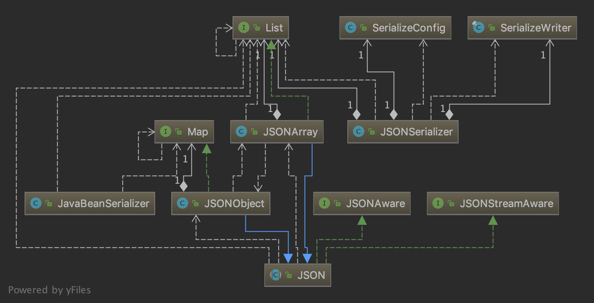

# 第二章：Serializer的结构

## 2.1 Serializer示例

fastjson 提供的 API 包含了各种类之间的转换方法，这一章要讨论的是序列化方法。序列化方法的 API 是 JSON.toJSONString\(\)。这个方法被重载多次，可以用于将多种不同的类型转化为字符串。在第一章的示例中，我们演示了 toJSONString\(\) 将一个 JSONObject 对象转化为字符串的操作，现在我们看几个更复杂的例子：

```java
Person tomy = new Person(12, "Tomy");
Person bob = new Person(10, "Bob");
List<Person> students = new ArrayList<Person>(Arrays.asList(tomy, bob));

System.out.println(JSON.toJSONString(tomy));
System.out.println(JSON.toJSONString(students));
System.out.println(JSON.toJSONString(tomy, SerializerFeature.BeanToArray));
```

这个测试用例的输出是：

```javascript
{"age":12,"name":"Tomy"}
[{"age":12,"name":"Tomy"},{"age":10,"name":"Bob"}]
[12,"Tomy"]
```

其中 Person 类是我自己设计的一个简单的 JavaBean（没有重写 toString\(\) 方法），只包含 age 和 name 两个属性。可以看出，toJSONString 方法能准确地将 JavaBean 转化为字符串，而且能够把 JavaBean 的 List 转化为 json 数组形式的字符串。而且在第三个打印示例中，我将一个 JavaBean 转化成了 json 数组形式的字符串，这在你不需要 key 的信息或者相比于 key 的信息你更关心缩减字符串长度和序列化速度时会很有用。

当然，你也可以把这些 JavaBean 对象转化成 JSONObject 或者 JSONArray，用 toJSON\(\) 方法就可以了。同样的，JavaBean 可以被转化成去掉 key 的 JSONArray。BeanToArray 是一种映射模式，与之对应的是反序列化的 ArrayToBean 模式。BeanToArray 模式和普通模式相比拥有更好的性能。

## 2.2 SerializeWriter 类与 JSONSerializer 类

JSON.toJSONString\(\) 方法在 JSON.java 中被重载了 10 次，其中大部分是为了简化方法调用，核心方法只有以下两个：



```java
public abstract class JSON implements JSONStreamAware, JSONAware {
    public static String toJSONString(Object object, int defaultFeatures, SerializerFeature... features) {
        SerializeWriter out = new SerializeWriter((Writer) null, defaultFeatures, features);

        try {
            JSONSerializer serializer = new JSONSerializer(out);
            serializer.write(object);
            return out.toString();
        } finally {
            out.close();
        }
    }
    
    public static String toJSONString(Object object, // 
                                      SerializeConfig config, // 
                                      SerializeFilter[] filters, // 
                                      String dateFormat, //
                                      int defaultFeatures, // 
                                      SerializerFeature... features) {
        SerializeWriter out = new SerializeWriter(null, defaultFeatures, features);

        try {
            JSONSerializer serializer = new JSONSerializer(out, config);
            
            if (dateFormat != null && dateFormat.length() != 0) {
                serializer.setDateFormat(dateFormat);
                serializer.config(SerializerFeature.WriteDateUseDateFormat, true);
            }

            if (filters != null) {
                for (SerializeFilter filter : filters) {
                    serializer.addFilter(filter);
                }
            }

            serializer.write(object);

            return out.toString();
        } finally {
            out.close();
        }
    }
}
```



忽略一些暂时还不用关心的细节，这两个方法本质是一样的。我们关注以下三句：

```java
SerializeWriter out = new SerializeWriter((Writer) null, defaultFeatures, features);
JSONSerializer serializer = new JSONSerializer(out);
serializer.write(object);
```

首先创造一个 SerializeWriter 对象 out，SerializeWriter 类继承自 java.io.Writer 类，内部通过组合一个 Writer 对象来实现。这使得 JSON 对 OutputStream 和 Writer 的支持成为可能，尽管这并不是 SerializeWriter 设计的主要目的。关注 SerializeWriter 类的一个字段 buf：



```java
public final class SerializeWriter extends Writer {
    protected char                           buf[];
    protected int                            count;
    private final Writer                     writer;
    /* 
    ***
    */
}
```



这个字符数组 buf 会在构造其中被分配长度，默认是 2048 \(v1.2.54\). 这使得 SerializeWriter 看起来和 StringBuilder 很相似。StringBuilder 的使用可以在拼接字符串时避免产生很多不必要的中间对象，而且主动指定字符缓冲区长度能够避免多次重新分配缓冲。同样，序列化 Java 对象时也需要考虑这个问题，SerializeWriter 的使用不仅是一种优化，在面向对象编程中也是必要的。

SerializeWriter.java 中就能找到写入缓冲区的方法实现：



```java
public final class SerializeWriter extends Writer { 
     /**
     * Writes a character to the buffer.
     */
    public void write(int c) {
        int newcount = count + 1;
        if (newcount > buf.length) {
            if (writer == null) {
                expandCapacity(newcount);
            } else {
                flush();
                newcount = 1;
            }
        }
        buf[count] = (char) c;
        count = newcount;
    }
}
```



write\(\) 方法也有直接写入多个字符的实现（事实上它继承自 Writer，是必须实现的），逻辑稍显复杂，我选择呈现写入单个字符的 write\(\)。通过这个实现能进一步确定 SerializeWriter 作为缓冲区的作用。

但 SerializeWriter.write\(\) 方法此时还不能被调用，在真正生成字符串之前，我们还需要很多信息：我们至少要知道我们要向 buf 里写什么！回到我之前浓缩的三条语句，第二条用已经生成的 SerializeWriter 对象 out 创建了一个 JSONSerializer 对象 serializer。这个类名让人有些摸不着头脑。serializer 对象中维护着一个 SerializeConfig 对象 config 和一个 SerializeWriter 对象 out，如下：



```java
public class JSONSerializer extends SerializeFilterable {
    protected final SerializeConfig                  config;
    public final SerializeWriter                     out;
}
```



在我们的例子中，构造方法只传入了 SerializeWriter，此时配置参数 config 由配置参数的全局实例替代（全局实例是一个不含任何额外信息的朴素常量）。当 serializer.write\(\) 被调用时，又一个名为 writer 被创建用来执行一个名字仍然是 write 的方法：



```java
public class JSONSerializer extends SerializeFilterable {
    public final void write(Object object) {
        if (object == null) {
            out.writeNull();
            return;
        }

        Class<?> clazz = object.getClass();
        ObjectSerializer writer = getObjectWriter(clazz);

        try {
            writer.write(this, object, null, null, 0);
        } catch (IOException e) {
            throw new JSONException(e.getMessage(), e);
        }
    }
}
```



这个 writer 本质上是一个 IdentityHashMap，先不讨论它的创建过程，我们通过参数传递知道这个 writer 包含了 object 的类型信息就可以了。回忆一下，在我们的测试用例中，上面这个函数的参数是一个 JavaBean。ObjectSerializer 接口中声明了 write\(\) 方法：



```java
public interface ObjectSerializer {
    void write(JSONSerializer serializer, //
               Object object, //
               Object fieldName, //
               Type fieldType, //
               int features) throws IOException;
}
```



最终 write 是如何执行的取决于从 getObjectWriter\(\) 中返回的 writer 是什么具体类型。这里我省去了很多细节，getObjectWriter\(\) 方法体很庞大，里面进行了很多判断，最终通过以下语句创建了一个 JavaBeanSerializer 对象并返回：

```java
writer = createJavaBeanSerializer(clazz);
```

这行代码接近整个方法体的底部，它执行的条件是之前所有对 clazz 的匹配都失败了，所以把它当作 JavaBean 处理。我们之前的分析中一直都没有太在意我们测试用例的具体情况导致程序执行流程的不同，因为我们几乎一直在程序主干——每个 toJSONString\(\) 几乎都要经历以上过程。从现在开始，我们进入 Serializer 的一小个分支中了：如果我们要序列化的 Object 不是一个 JavaBean，在 SerializeConfig.getObjectWriter\(\) 执行后会返回其它的 ObjectSerializer 类型。

我们总算是找到了 write\(\) 的方法体，但是 JavaBeanSerializer.write\(\) 方法体篇幅有近四百行，这就是序列化的具体算法代码了。现在不是咀嚼算法的时候，我们只关心已经快要被遗忘的 SerializerWriter 和它的成员方法 SerializerWriter.write\(\) 。意料之中，JavaBeanSerializer.write\(\) 方法体正是围绕它的第一个参数 serializer 展开的，而这个 serializer 就维护着我们的 SerializerWriter 对象 out：

```java
protected void write(JSONSerializer serializer, 
                     Object object, 
                     Object fieldName, 
                     Type fieldType, 
                     int featureboolean unwrapped) throws IOException {
    SerializeWriter out = serializer.out;
    /* 
    ***
    */
}
```

第一条语句就提取出了 out 对象，后面的过程中不断地回调 out 的方法，其中就包含了 write\(\)，从而真正做到把序列化产生的字符以及字符串写回 buf。

## 2.3 SerializeConfig相关细节

刚刚经过一段很长的旅程，是时候回顾一下我们为一个 Bean 创建一个 Serializer 的过程了：



这张图体现了我们在 2.2 中分析过的一些类之间的关系。我只显示了类名和类之间的继承、组合关系（方法依赖、类字段、类方法中的任何一个出现在图中都会使得图变成一团乱麻）。位于图底部的 JSON 是 API 入口，由于它实现了 JSONAware，我们可以调用静态方法 toJSONString\(\)。要完成 toJSONString\(\) 的功能，就要创建一个 SerializeWriter 对象用来暂存序列化产生的字符串，一个 SerializeConfig 对象用来保存和匹配类型信息，一个 JSONSerializer 对象用来维护以上两个对象并完成序列化主要职责。第一次解析 JavaBean 对象时，创建了一个 JavaBeanSerializer 对象，并把 this 作为参数传入 JavaBeanSerializer 对象的成员函数中，通过回调完成序列化。

### 2.3.1 维护配置信息的数据结构

当我们在 JSONSerializer 中调用 getObjectWriter\(\) 方法时，我提到：“如果我们要序列化的 Object 不是一个 JavaBean，在 SerializeConfig.getObjectWriter\(\) 执行后会返回其它的 ObjectSerializer 类型。”如果我们再次序列化一个同样的 JavaBean 呢？我们所走的道路会和之前一样吗？

假设两次序列化所做的事情一样，那么 fastjson 的设计就不合理，至少在效率上很糟糕。因为序列化器第一次“遇见”测试示例中的 JavaBean —— Person 时，为 Person 单独创建了一个 JavaBeanSerializer 对象。如果我们再次遇见 Person，应当很快识别出这个“老朋友”，并为它配置对应的 JavaBeanSerializer 才对。

fastjson 是怎样做的呢？一个 SerializeConfig 对象维护一个名为 serializers 的 IdentityHashMap。由于我们目前只见过 SerializeConfig 的 static 对象——一个 global instance（1.2.55 版本是这样的，旧版本的实现可能有所不同），它的创建方式类似于 Singleton 模式中的“饿汉式”，不用担心它的线程安全性，但它并不是 Singleton 模式。 getObjectSerializer\(\) 方法在创建 JavaBeanSerializer 后并没有立即返回，而是进行了如下操作：

```java
writer = createJavaBeanSerializer(clazz);
put(clazz, writer);
```

put\(\) 方法调用 serializers 的 put\(\) 方法，通过 serializers 的具体类型：

```java
private final IdentityHashMap<Type, ObjectSerializer> serializers;
```

可以看出 serializers 存放的即是待序列化数据类型和对应的序列化器对。当第一次执行到 SerializeConfig 的 getObjectSerializer\(\) 方法时，serializers 中添加了这个配置信息（注册）；当第二次执行到这个方法时，会在方法体的第一行：

```java
ObjectSerializer writer = serializers.get(clazz);
```

得到正确的 JSONSerializer，然后直接返回，速度比第一次序列化快很多。此处保留一个疑问：为什么使用 IdentityHashMap 而不是 HashMap.

### 2.3.2 内部注册的序列化方案

在 SerializeConfig 类中，有一个初始化 serializers 的方法：



```java
public class SerializeConfig {
    ...    
    private void initSerializers() {
        put(Boolean.class, BooleanCodec.instance);
        put(Character.class, CharacterCodec.instance);
        put(Byte.class, IntegerCodec.instance);
        put(Short.class, IntegerCodec.instance);
        put(Integer.class, IntegerCodec.instance);
        put(Long.class, LongCodec.instance);
        put(Float.class, FloatCodec.instance);
        put(Double.class, DoubleSerializer.instance);
        put(BigDecimal.class, BigDecimalCodec.instance);
        put(BigInteger.class, BigIntegerCodec.instance);
        put(String.class, StringCodec.instance);
        put(byte[].class, PrimitiveArraySerializer.instance);
        put(short[].class, PrimitiveArraySerializer.instance);
        put(int[].class, PrimitiveArraySerializer.instance);
        put(long[].class, PrimitiveArraySerializer.instance);
        put(float[].class, PrimitiveArraySerializer.instance);
        put(double[].class, PrimitiveArraySerializer.instance);
        put(boolean[].class, PrimitiveArraySerializer.instance);
        put(char[].class, PrimitiveArraySerializer.instance);
        put(Object[].class, ObjectArrayCodec.instance);
        put(Class.class, MiscCodec.instance);

        put(SimpleDateFormat.class, MiscCodec.instance);
        put(Currency.class, new MiscCodec());
        put(TimeZone.class, MiscCodec.instance);
        put(InetAddress.class, MiscCodec.instance);
        put(Inet4Address.class, MiscCodec.instance);
        put(Inet6Address.class, MiscCodec.instance);
        put(InetSocketAddress.class, MiscCodec.instance);
        put(File.class, MiscCodec.instance);
        put(Appendable.class, AppendableSerializer.instance);
        put(StringBuffer.class, AppendableSerializer.instance);
        put(StringBuilder.class, AppendableSerializer.instance);
        put(Charset.class, ToStringSerializer.instance);
        put(Pattern.class, ToStringSerializer.instance);
        put(Locale.class, ToStringSerializer.instance);
        put(URI.class, ToStringSerializer.instance);
        put(URL.class, ToStringSerializer.instance);
        put(UUID.class, ToStringSerializer.instance);

        // atomic
        put(AtomicBoolean.class, AtomicCodec.instance);
        put(AtomicInteger.class, AtomicCodec.instance);
        put(AtomicLong.class, AtomicCodec.instance);
        put(AtomicReference.class, ReferenceCodec.instance);
        put(AtomicIntegerArray.class, AtomicCodec.instance);
        put(AtomicLongArray.class, AtomicCodec.instance);

        put(WeakReference.class, ReferenceCodec.instance);
        put(SoftReference.class, ReferenceCodec.instance);

        put(LinkedList.class, CollectionCodec.instance);
    }
    ...
}
```



该方法在构造时被调用，属于构造的一部分。除了在构造时被调用，还在重置配置信息时被调用，如下：



```java
    public void clearSerializers() {
        this.serializers.clear();
        this.initSerializers();
    }
```



从这表格状的代码可以看出内部注册的序列化方案。值得注意的是，序列化器的名字既有以 Codec 结尾的，也有以 Serializer 结尾的，这个差别的本质将在下一章揭示。还值得注意的一点是，每个 Codec 类和 Serializer 类都维护了一个 instance 对象，这有些类似于设计模式中的 Singleton 模式，但不严格，这个情况和之前一直被提及的 SerializeConfig.globalInstance 很相似。

每一种内部注册序列化器的 write\(\) 方法具体实现大同小异，想要对这部分具体了解的读者可以阅读每个序列化器的 write\(\) 方法，有时这会让你奇怪：既然好几种 write\(\) 的实现都只是有细微的区别，为什么不采取一种能够复用代码的机制，让事情变得简洁？的确，Google 的 Json 库 gson，就在这里采取了 Adapter 模式，代码看上去非常简洁，但背后的实用性有待讨论。

另外，我们还不能忽略 fastjson 的某个初衷：让速度变得很快！也许在 fastjson 的作者看来，在复用层面做一些妥协而尽可能针对每一种具体情况压榨性能是值得的。

