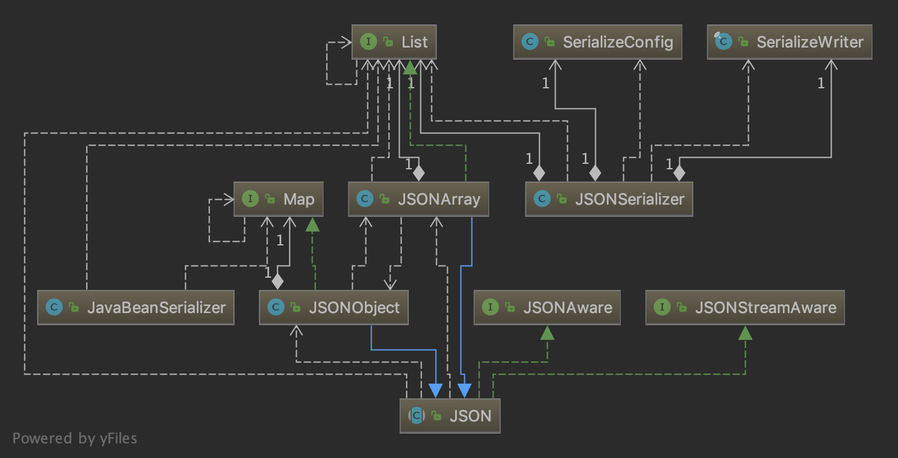

# 第三章：SerializeConfig相关细节

在第二章，我们经过一段很长的旅程，是时候回顾一下我们为一个 Bean 创建一个 Serializer 的过程了：



这张图体现了我们在 2.2 中分析过的一些类之间的关系。我只显示了类名和类之间的继承、组合关系（方法依赖、类字段、类方法中的任何一个出现在图中都会使得图变成一团乱麻）。位于图底部的 JSON 是 API 入口，由于它实现了 JSONAware，我们可以调用静态方法 toJSONString\(\)。要完成 toJSONString\(\) 的功能，就要创建一个 SerializeWriter 对象用来暂存序列化产生的字符串，一个 SerializeConfig 对象用来保存和匹配类型信息，一个 JSONSerializer 对象用来维护以上两个对象并完成序列化主要职责。第一次解析 JavaBean 对象时，创建了一个 JavaBeanSerializer 对象，并把 this 作为参数传入 JavaBeanSerializer 对象的成员函数中，通过回调完成序列化。

## 3.1 维护配置信息的数据结构

当我们在 JSONSerializer 中调用 getObjectWriter\(\) 方法时，我提到：“如果我们要序列化的 Object 不是一个 JavaBean，在 SerializeConfig.getObjectWriter\(\) 执行后会返回其它的 ObjectSerializer 类型。”如果我们再次序列化一个同样的 JavaBean 呢？我们所走的道路会和之前一样吗？

假设两次序列化所做的事情一样，那么 fastjson 的设计就不合理，至少在效率上很糟糕。因为序列化器第一次“遇见”测试示例中的 JavaBean —— Person 时，为 Person 单独创建了一个 JavaBeanSerializer 对象。如果我们再次遇见 Person，应当很快识别出这个“老朋友”，并为它配置对应的 JavaBeanSerializer 才对。

fastjson 是怎样做的呢？一个 SerializeConfig 对象维护一个名为 serializers 的 IdentityHashMap。由于我们目前只见过 SerializeConfig 的 static 对象——一个 global instance（1.2.55 版本是这样的，旧版本的实现可能有所不同），它的创建方式类似于 Singleton 模式中的“饿汉式”，不用担心它的线程安全性，但它并不是 Singleton 模式。 getObjectSerializer\(\) 方法在创建 JavaBeanSerializer 后并没有立即返回，而是进行了如下操作：

```java
writer = createJavaBeanSerializer(clazz);
put(clazz, writer);
```

put\(\) 方法调用 serializers 的 put\(\) 方法，通过 serializers 的具体类型：

```java
private final IdentityHashMap<Type, ObjectSerializer> serializers;
```

可以看出 serializers 存放的即是待序列化数据类型和对应的序列化器对。当第一次执行到 SerializeConfig 的 getObjectSerializer\(\) 方法时，serializers 中添加了这个配置信息（注册）；当第二次执行到这个方法时，会在方法体的第一行：

```java
ObjectSerializer writer = serializers.get(clazz);
```

得到正确的 JSONSerializer，然后直接返回，速度比第一次序列化快很多。此处保留一个疑问：为什么使用 IdentityHashMap 而不是 HashMap.

## 3.2 内部注册的序列化方案

在 SerializeConfig 类中，有一个初始化 serializers 的方法：



```java
public class SerializeConfig {
    ...    
    private void initSerializers() {
        put(Boolean.class, BooleanCodec.instance);
        put(Character.class, CharacterCodec.instance);
        put(Byte.class, IntegerCodec.instance);
        put(Short.class, IntegerCodec.instance);
        put(Integer.class, IntegerCodec.instance);
        put(Long.class, LongCodec.instance);
        put(Float.class, FloatCodec.instance);
        put(Double.class, DoubleSerializer.instance);
        put(BigDecimal.class, BigDecimalCodec.instance);
        put(BigInteger.class, BigIntegerCodec.instance);
        put(String.class, StringCodec.instance);
        put(byte[].class, PrimitiveArraySerializer.instance);
        put(short[].class, PrimitiveArraySerializer.instance);
        put(int[].class, PrimitiveArraySerializer.instance);
        put(long[].class, PrimitiveArraySerializer.instance);
        put(float[].class, PrimitiveArraySerializer.instance);
        put(double[].class, PrimitiveArraySerializer.instance);
        put(boolean[].class, PrimitiveArraySerializer.instance);
        put(char[].class, PrimitiveArraySerializer.instance);
        put(Object[].class, ObjectArrayCodec.instance);
        put(Class.class, MiscCodec.instance);

        put(SimpleDateFormat.class, MiscCodec.instance);
        put(Currency.class, new MiscCodec());
        put(TimeZone.class, MiscCodec.instance);
        put(InetAddress.class, MiscCodec.instance);
        put(Inet4Address.class, MiscCodec.instance);
        put(Inet6Address.class, MiscCodec.instance);
        put(InetSocketAddress.class, MiscCodec.instance);
        put(File.class, MiscCodec.instance);
        put(Appendable.class, AppendableSerializer.instance);
        put(StringBuffer.class, AppendableSerializer.instance);
        put(StringBuilder.class, AppendableSerializer.instance);
        put(Charset.class, ToStringSerializer.instance);
        put(Pattern.class, ToStringSerializer.instance);
        put(Locale.class, ToStringSerializer.instance);
        put(URI.class, ToStringSerializer.instance);
        put(URL.class, ToStringSerializer.instance);
        put(UUID.class, ToStringSerializer.instance);

        // atomic
        put(AtomicBoolean.class, AtomicCodec.instance);
        put(AtomicInteger.class, AtomicCodec.instance);
        put(AtomicLong.class, AtomicCodec.instance);
        put(AtomicReference.class, ReferenceCodec.instance);
        put(AtomicIntegerArray.class, AtomicCodec.instance);
        put(AtomicLongArray.class, AtomicCodec.instance);

        put(WeakReference.class, ReferenceCodec.instance);
        put(SoftReference.class, ReferenceCodec.instance);

        put(LinkedList.class, CollectionCodec.instance);
    }
    ...
}
```



该方法在构造时被调用，属于构造的一部分。除了在构造时被调用，还在重置配置信息时被调用，如下：



```java
    public void clearSerializers() {
        this.serializers.clear();
        this.initSerializers();
    }
```



从这表格状的代码可以看出内部注册的序列化方案。值得注意的是，序列化器的名字既有以 Codec 结尾的，也有以 Serializer 结尾的，这个差别的本质将在第五章揭示。还值得注意的一点是，每个 Codec 类和 Serializer 类都维护了一个 instance 对象，这有些类似于设计模式中的 Singleton 模式，但不严格，这个情况和之前一直被提及的 SerializeConfig.globalInstance 很相似。

每一种内部注册序列化器的 write\(\) 方法具体实现大同小异，想要对这部分具体了解的读者可以阅读每个序列化器的 write\(\) 方法，有时这会让你奇怪：既然好几种 write\(\) 的实现都只是有细微的区别，为什么不采取一种能够复用代码的机制，让事情变得简洁？的确，Google 的 Json 库 gson，就在这里采取了 Adapter 模式，代码看上去非常简洁，但背后的实用性有待讨论。

另外，我们还不能忽略 fastjson 的某个初衷：让速度变得很快！也许在 fastjson 的作者看来，在复用层面做一些妥协而尽可能针对每一种具体情况压榨性能是值得的。

