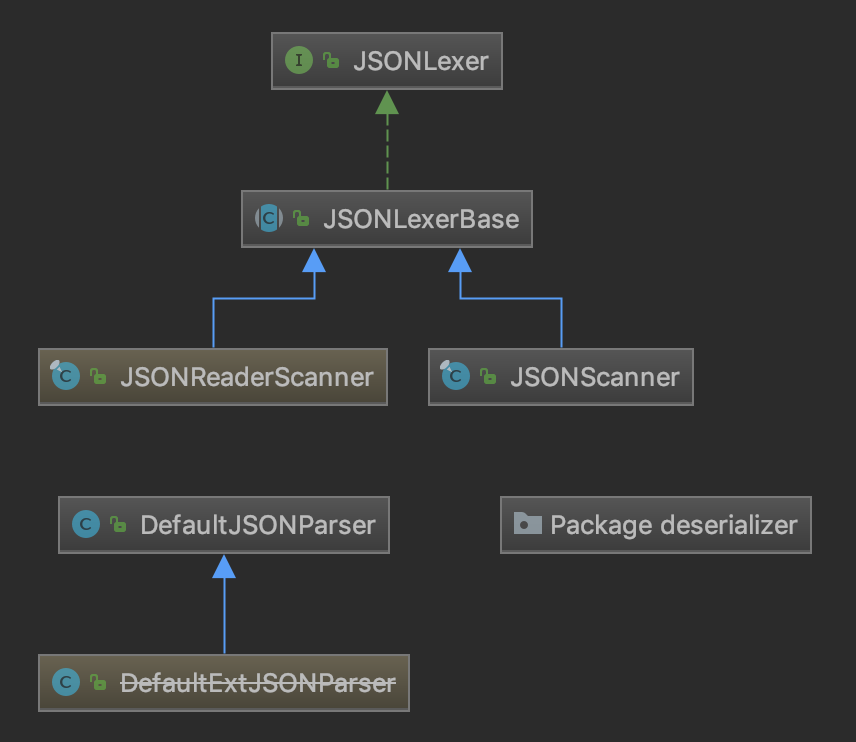

# 第一章：导言

导言部分将会从一些简单的示例入手，从浅层面、多方面、以面向对象的视角展示以及分析部分源码。

## 1.1 什么是 JSON

曾经有一段时间，XML 是互联网上传输结构化数据的标准。Web 服务的第一次浪潮很大程度上都是建立在 XML 上的，突出的特点是服务器与服务器之间的通信。然而，业界一直不乏质疑 XML 的声音。不少人认为 XML 过于繁琐、冗长。为解决这个问题，也涌现了一些方案。不过，Web 的发展方向已经改变了。

2006 年，Douglas Crockford 把 JSON（JavaScript Object Notation，即 JavaScript 对象表示法）作为 IETF RFC 4627 提交给 IETF，而 JSON 的应用早在 2001 年就已经开始了。JSON 是 JavaScript 的一个严格的子集，利用了 JavaScript 中的一些模式来表示结构化数据。Crockford 认为与 XML 相比，JSON 是在 JavaScript 中读写结构化数据的更好的方式。因为可以把 JSON 直接传给 eval\(\), 而且不必创建 DOM 对象。

关于 JSON，最重要的是要理解它是一种数据格式，而不是一种编程语言。虽然具有相同的语法形式，但 JSON 并不属于 JavaScript。而且，并不是只有 JavaScript 才使用 JSON，毕竟 JSON 只是一种数据格式。很多编程语言都有针对 JSON 的解析器和序列化器。

> （美）Nicholas C. Zakas. Professional JavaScript for Web Developers 3rd Edition \[M\].北京：人民邮电出版社，2012.3（2017.10重印）: 562

## 1.2 什么是 fastjson

fastjson 是阿里巴巴的开源 JSON 解析库，它可以解析 JSON 格式的字符串，支持将Java Bean 序列化为 JSON 字符串，也可以从 JSON 字符串反序列化到 JavaBean。fastjson 是个非常优秀的 JSON 解析库，被不少企业使用，其优点主要在于：

### 速度快

fastjson 相对其他 JSON 库的特点是快，从 2011 年 fastjson 发布 1.1.x 版本之后，其性能从未被其他 Java 实现的 JSON 库超越。

### 使用广泛

fastjson 在阿里巴巴大规模使用，在数万台服务器上部署，fastjson 在业界被广泛接受。在 2012 年被开源中国评选为最受欢迎的国产开源软件之一。

### 测试完备

fastjson 有非常多的 testcase，在 1.2.11 版本中，testcase 超过 3321 个。每次发布都会进行回归测试，保证质量稳定。

### 使用简单

fastjson 的 API 十分简洁：

```text
String text = JSON.toJSONString(obj); //序列化
VO vo = JSON.parseObject("{...}", VO.class); //反序列化
```

### 功能完备

支持泛型，支持流处理超大文本，支持枚举，支持序列化和反序列化扩展。

> [https://github.com/alibaba/fastjson/wiki/Quick-Start-CN](https://github.com/alibaba/fastjson/wiki/Quick-Start-CN)

## 1.3 从简单示例漫游 fastjson

一个针对 Java 的 JSON 解析框架最基本的功能是解析和序列化，下面示例定义了一个简单的复合 JSON Object 语法的 Java 字符串：

```java
String jobjstr = "{" +
    "\"name\": \"John\"," +
    "\"age\": 18" +
    "}";
```

由于 JSON 本身有很好的可读性，所以这里不再对字符串的内容加以解释。现在我们使用 fastjson 框架，用 parse 方法将上述字符串解析为 Java 对象：

```java
JSONObject jobj = JSONObject.parseObject(jobjstr);
System.out.println("name: " + jobj.getString("name") +
    ", age: " + jobj.getInteger("age"));
```

这段测试程序输出的结果是：

```java
name: John, age: 18
```

现在将之前得到的 JSONObject 对象转化为字符串：

```java
String str = jobj.toJSONString();
System.out.println(str);
```

输出结果为：

```java
{"name":"John","age":18}
```

现在我们关注解析字符串的关键语句：

```java
JSONObject jobj = JSONObject.parseObject(jobjstr);
```

让我们追根溯源，看看 JSONObject.parseObject\(String\) 方法到底是怎么工作的。首先，parseObject\(String\) 方法并不是 JSONObject 类中定义的静态方法，而是 JSONObject 继承自 JSON 类的一个静态方法，且没有重写，所以这条语句写成 JSONObject jobj = JSON.parseObject\(jobjstr\) 也是完全没有问题的（事实上，JSON 类就是 fastjson 使用的入口）。以下代码中，除了少数注释为我自己添加，其余部分均来自[github.com/alibaba/fastjson](http://github.com/alibaba/fastjson)，这些代码和编译工具通过 .class 文件反编译出的代码大同小异（不得不说，IntelliJ IDEA 的 Fernflower 反编译器产生的代码有很好的可读性）。以下是该方法的定义：



```java
    public static JSONObject parseObject(String text) {
        Object obj = parse(text);
        if (obj instanceof JSONObject) {
            return (JSONObject) obj;
        }
    
        try {
            return (JSONObject) JSON.toJSON(obj);
        } catch (RuntimeException e) {
            throw new JSONException("can not cast to JSONObject.", e);
        }
    }
// 该方法中调用了重载的 parseObject 方法，定义如下

    public static JSONObject parseObject(String text, Feature... features) {
        return (JSONObject) parse(text, features);
    }
// 该方法又调用了 parse 方法，定义如下
    public static Object parse(String text, Feature... features) {
        int featureValues = DEFAULT_PARSER_FEATURE;
        for (Feature feature : features) {
            featureValues = Feature.config(featureValues, feature, true);
        }

        return parse(text, featureValues);
    }

    public static Object parse(String text, int features) {
        return parse(text, ParserConfig.getGlobalInstance(), features);
    }
// 继续追溯

    public static Object parse(String text, ParserConfig config, int features) {
        if (text == null) {
            return null;
        }

        DefaultJSONParser parser = new DefaultJSONParser(text, config, features);
        Object value = parser.parse();

        parser.handleResovleTask(value);

        parser.close();

        return value;
    }
```



最终我们发现，真正的解析工作是一个实例化的解析器 parser 完成的，关键的方法是 parse\(\) 方法，现在我们可以进入 DefaultJSONParser 的内部探索：



```java
    public Object parse() {
        return parse(null);
    }
    // Java 不支持默认参数，用方法重载来达到简化调用的效果

    // 下面的方法接近100行，省略了大部分case
    public Object parse(Object fieldName) {
        final JSONLexer lexer = this.lexer;
        switch (lexer.token()) {
            ...
            case LBRACE:
                JSONObject object = new JSONObject(lexer.isEnabled(Feature.OrderedField));
                return parseObject(object, fieldName);
            ...
            default:
                throw new JSONException("syntax error, " + lexer.info());
        }
    }
```



为了完整性，我粘贴出了整个方法实现。词法分析是整个解析算法的基础，很重要，但不是我们研究的重点，所以这里不进行详细解释。在我们的例子中我定义的字符串 jobjstr 开头为左花括号'{'，因此在 switch-case 语句中，我们直接定位到第10行：

```java
case LBRACE:
    JSONObject object = new JSONObject(lexer.isEnabled(Feature.OrderedField));
    return parseObject(object, fieldName);
```

也就是说，当解析器检查发现第一个字符为左花括号时，便调用 parseObject 方法来解析花括号内部的内容。我们知道花括号内部必定是个 JSON Object，当然，它也有可能是个复杂 Object，所以我们可以猜测，parseObject 方法内必定有对 parseArray 和 parseObject 方法的递归调用。要注意，此时的 parseObject 方法和最初我们在 JSON.java 中发现的静态方法 JSON.parseObject 是完全不同的，前者是算法层面的调用，而非提供给用户的调用。

这里将不再展示 parseObject 方法内部的逻辑，一是由于这个方法的定义本身就很庞大，不适合一次性粘贴；二是因为第一章的目标已经达到了，我们完成了一次近乎完整的 fastjson 漫游，没必要注意太多细节，parse 方法作为整个解析算法的核心，必定会再度被讨论，但不是现在。

## 1.4 面向接口编程

我们已经通过一个简单的程序示例跟踪了 fastjson 的解析功能，下面我们将从不一样的角度来分析序列化功能。在研读源码前，我们可以先看一看 UML 类图，回顾一下漫游旅程。以下是1.3中出现过的包的类图：




为了节省篇幅，我省略了所有的字段、构造方法、一般方法和内部类。我们追踪的 DefaultJSONParser 就在这个 package parser 中，而 JSONObject 类以及其父类 JSON 在 package fastjson 中。

无论是通过源码文件中的类定义代码还是 UML 类图，都能很容易发现 JSON 类实现了结构 JSONStreamAware 和 JSONAware。这两个接口的定义很简单，源码如下：



```java
public interface JSONStreamAware {

    /**
     * write JSON string to out.
     */
    void writeJSONString(Appendable out) throws IOException;
}
```





```java
public interface JSONAware {

    /**
     * @return JSON text
     */
    String toJSONString();
}
```



JSONStreamAware 在所有支持 JSON 文本自定义输出到一个 Writer 的 Bean 中都应该被实现，而 JSONAware 在支持 JSON 文本自定义输出为字符串的 Bean 中都应该被实现。在 Java 程序设计语言中，接口 interface 提供了比抽象类“更加抽象”的抽象。如 Bruce Eckel 在《Java编程思想》中所言：“一个接口表示：‘所有实现了该特定接口的类看起来都像这样’。“以及”接口被用来建立类与类之间的协议“。

这里保留一个问题：在图 Package fastjson 中，JSONStreamAware 接口看起来仅被 JSON 类实现了。以抽象的原则而言，接口的出现是为了更好地实现解耦和多态，仅有一个类实现接口是体现不出多态的。

回到上面提到的 JSONAware 接口，为了更好地说明它的作用，我们结合另一个接口的例子。下面是 serializer 的 UML 类图的一部分：


从这张模糊的截图也许不能获得很有用的信息，我只是想借此展现这个包中的大多数类都实现了 ObjectSerializer 这个接口，这个接口的定义如下：



```java
public interface ObjectSerializer {
    void write(JSONSerializer serializer, //
               Object object, //
               Object fieldName, //
               Type fieldType, //
               int features) throws IOException;
}
```



同样只有一个抽象方法！按照 Bruce Eckel 的说法，序列化器都应该像这样——拥有一个 write 方法，在不同的场景下完成相同的输出功能。这就意味着，对于上层调用，不需要考虑每一个序列化器具体是如何工作的，只需要针对不用的场景使用正确的序列化器即可。

现在我们终于可以回到 JSONAware 了，在 JSONAwareSerializer 中，JSONAware 作为接口体现了它解耦的功能：



```java
public class JSONAwareSerializer implements ObjectSerializer {

    public static JSONAwareSerializer instance = new JSONAwareSerializer();

    public void write(JSONSerializer serializer, Object object, Object fieldName, Type fieldType, int features) throws IOException {
        SerializeWriter out = serializer.out;

        if (object == null) {
            out.writeNull();
            return;
        }

        JSONAware aware = (JSONAware) object;
        out.write(aware.toJSONString());
    }
}
```



现在整个序列化器的结构就清晰很多了：接口 ObjectSerializer 规定序列化器必须有 write 方法，这是序列化器和上层调用之间的协议，JSONAwareSerializer 作为一个序列化器实现了自己的 write 方法。JSONAware 接口规定 toJSONString 方法必须被实现，这是 JSONAware 和序列化器之间的协议，JSONAwareSerializer 在实现中用到了 JSONAware 接口的 toJSONString 方法。同层次的类有相似之处，不同层次的类之间相互调用却有条不紊，通过利用接口达到了解耦的效果。

## 1.5 第一章结语？

在以上所有类图和源码中，不难发现一个事实：接口的功能重要而单一！这符合设计原则的单一职责原则。面向对象设计原则被总结为7或8个，有趣的是，这些原则本身就是“紧耦合”的。

一般来说，好的设计是能同时满足所有原则的，例如，在 fastjson 中，凡是使用了继承语法的地方，子类和父类之间必定有很强的“血缘”关系（事实上用到的继承语法很少），否则就会使用组合语法而不是继承。这符合开放封闭原则、里氏替换原则和合成/聚合原则。又例如上述的接口功能单一，符合依赖倒置原则、接口隔离原则，而接口的运用本身就满足了迪米特原则……

相反，如果发现某个设计破坏了其中的一个原则，那么它往往也破坏了几个其它的原则。归根结底，这些设计原则强调的都是同样的宗旨：抽象和封装。

fastjson 作为非常优秀的框架，自然还有很多值得挖掘的地方。在接下来的几章，我将会详细介绍其中序列化器、反序列化器的设计，词法、语法解析的实现方式，设计模式的分析等等。

另一方面，由于我先前没有系统学过 Java，只能在学习 fastjson 源码的过程中慢慢学习。目前写得少见得也少，不知道好的代码有多好，差的代码又怎么糟糕。在学习 fastjson 期间，我还会阅读一些其它项目的源码，在对比中分析、学习。

随着自己对面向对象的理解的深入，以上所有内容在未来必定会有所改动。

我的课堂展示是第二次，恳切希望自己能在那之前有足够的积累，争取能给老师、同学带来干活十足又不失趣味的一次展示。

11 月 1日

